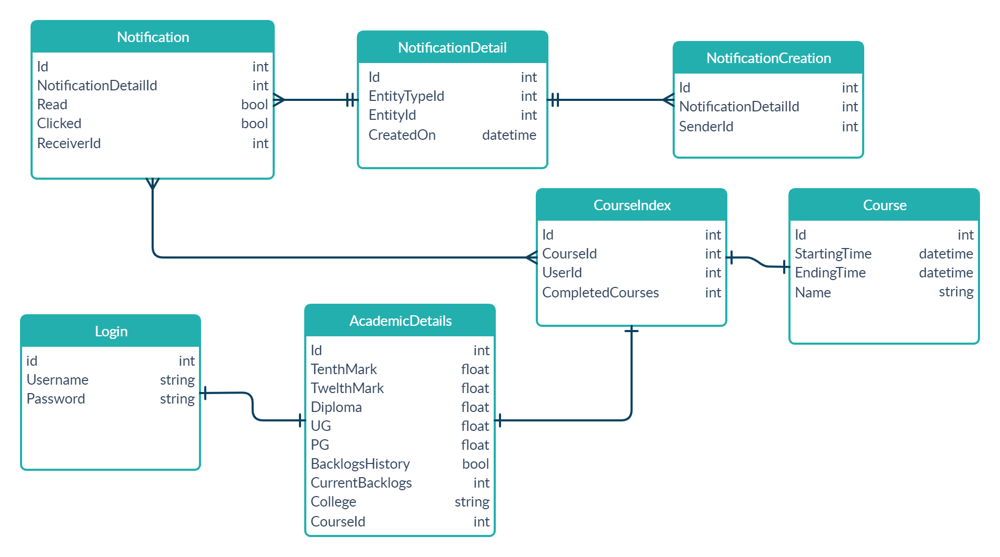

Login page with notifications system using NodeJS with express for Examly

## Database Type ##
* Since we are storing structured data i went with MySQL.
* Since we would display only a particular number of notifications when the user clicks the notificatoin bell, going with MySQL seemed better.
* Considering the requirements visualizing database as tables makes more sense than visualizing the data as a bunch of documents.

## Database Schema ##

* Entity will help us to know what the notification is about. For example, a notification can be about a creation of a course, course completion of a student etc. To get the details of any entity, all we need is to know entity table’s primary key value. This value will be referred as entityId.
* Entity types are the different types of notifications. To identify each entity, we will give an ID to each and every entity type.
* Read and Clicked maintains the asked metadata.

## Hosted URL ##

Website functions:
* Login with credentials
  abilash@gmail.com abilash@123,
  krish@gmail.com krish@123,
  harry@gmail.com harry@123,
  john@gmail.com john@123  (There are many more in db use any one)

* Add course
  * It acts as a teacher here since the project is not fully completed.
  * Adding a course will add courses to all the students and they get notifications.

* Notification
  * Clicking the notification will redirect to another page since iam working with it to show it as a dropdown.
  * Click back

* Logout
  * Press logout and check if the course is added to other students.
